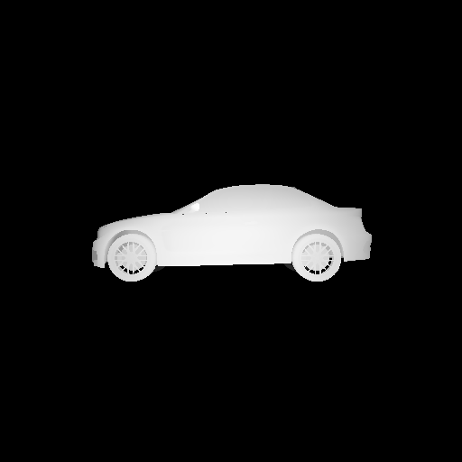
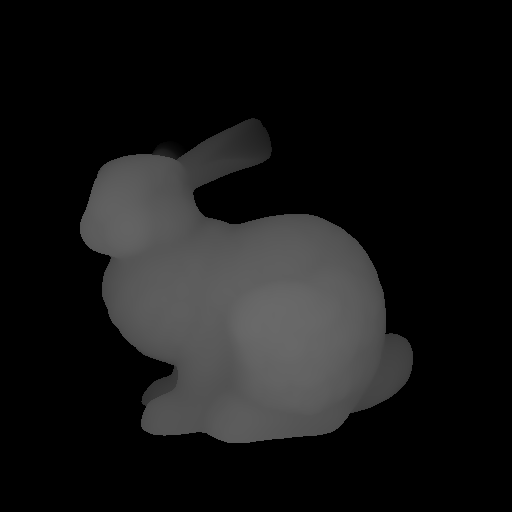
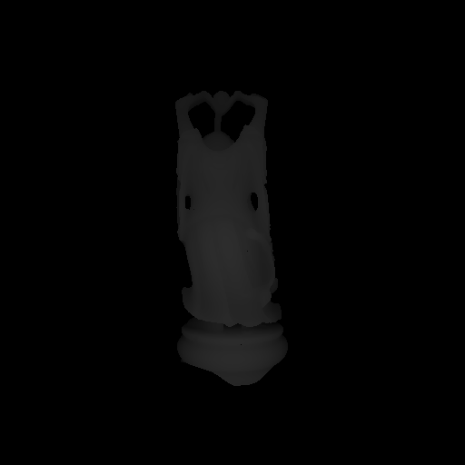
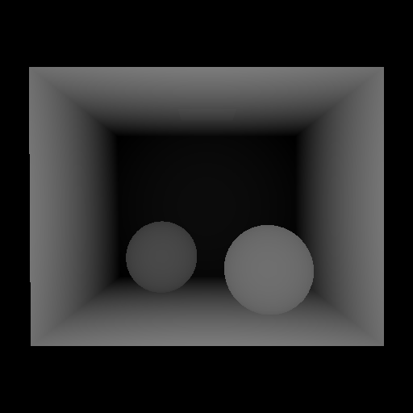
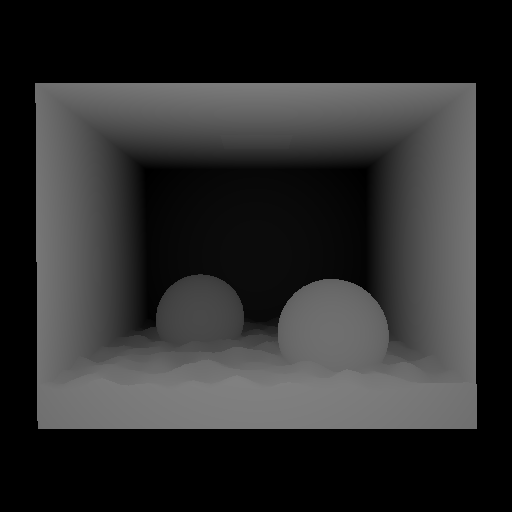
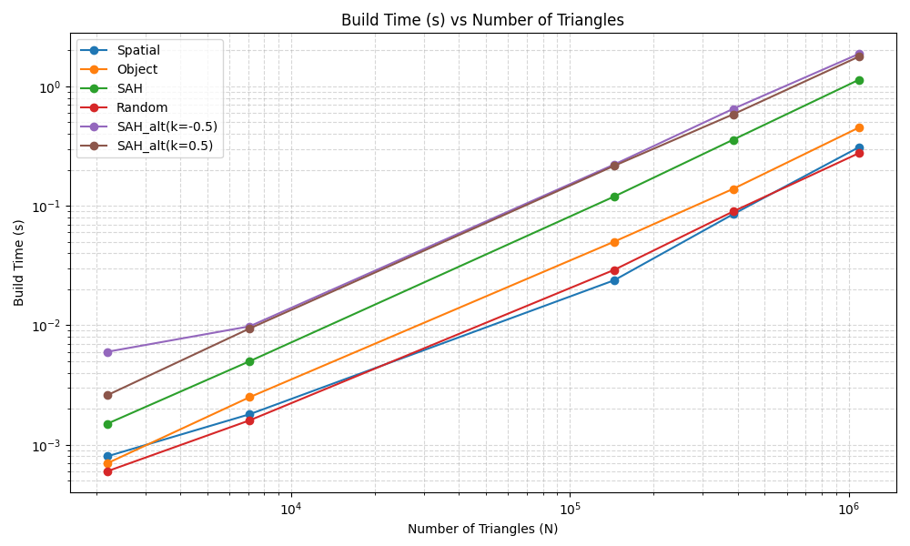
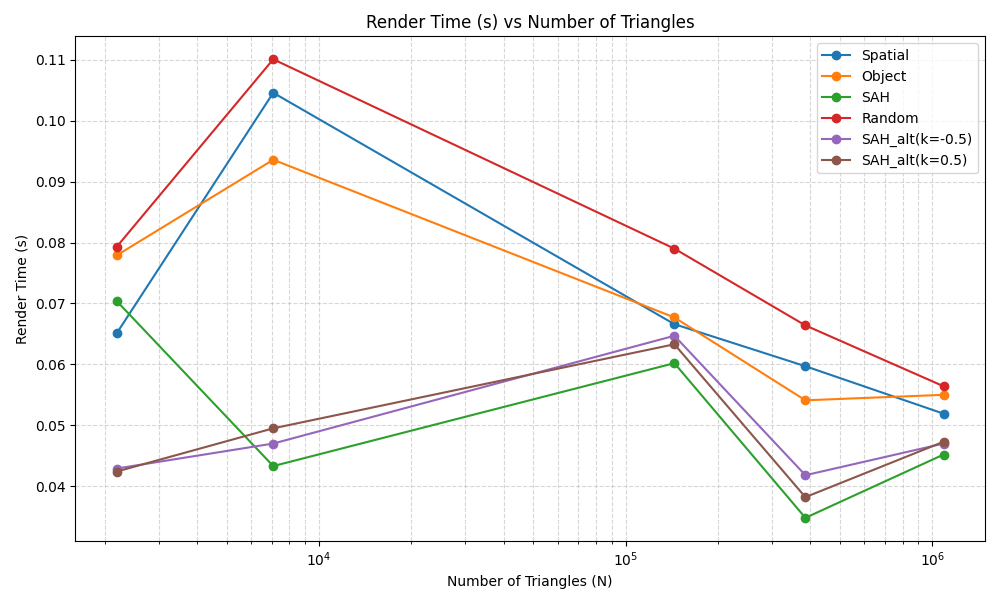
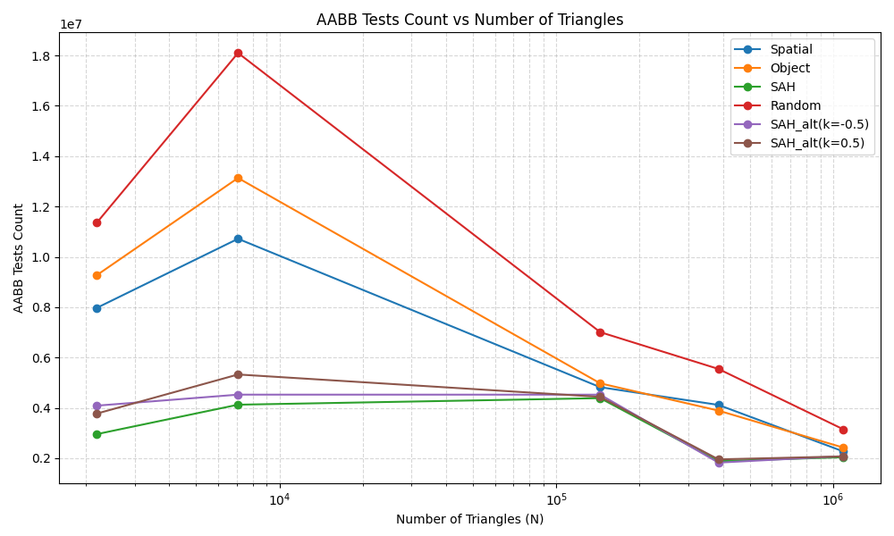
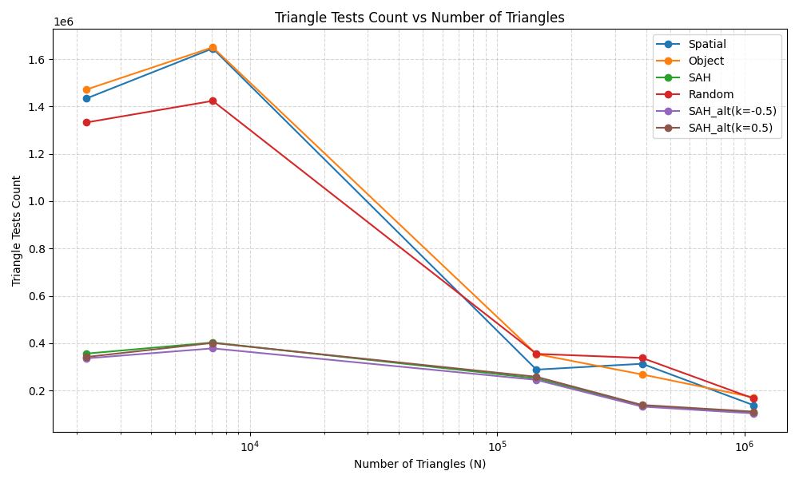

# Acceleration Data Structureの実装
- 氏名: 小原 悠
- 学籍番号: 05251012

## 1. 実装したこと
Bounding Volume Hierarchyを実装した。
複数のAABBの分割形式を使用できる様に、分割戦略をブラックボックス化した実装を行い、ランダムな分割、座標の中点による分割、オブジェクトの中央値による分割、AABBの表面積による分割(SAH)およびSAHのデータサイズの重みを0.5乗/1.5乗に改変したものの6種類の分割戦略を実装した。
また、実装の正しさの確認のため、簡単なレイトレーサーも実装した。これはobjファイルを定点から読み込み、ppmファイルとして出力するものである。

Bounding Volume Hierarchyとは、オブジェクト群を再帰的に分割し、それを包むラップであるAABBを木構造にしたものである。レイとの衝突判定においては、木をDFS順に探索することで、オブジェクトが十分小さい環境下でおおよそ対数時間での衝突判定が可能になる。

レポジトリ: https://github.com/Vi24E/CG_Assignment3

以下はテストデータのレイトレース結果である。

  
   <em>図1: BMWモデルのレンダリング結果</em>
    
  
   <em>図2: Bunnyモデルのレンダリング結果</em>
    
  
   <em>図3: Buddhaモデルのレンダリング結果</em>
    
  
   <em>図4: CornellBox-Sphereモデルのレンダリング結果</em>
    
  
   <em>図5: CornellBox-Waterモデルのレンダリング結果</em>

## 2. 結果の分析
各モデルの規模（三角形の数）に対するパフォーマンスの変化を以下のグラフに示す。横軸は三角形の数であり、対数スケールで表示している。Build time以外は262,144本のレイについての合計時間である。

  
   <em>図6: モデルの三角形数とBVH構築時間の関係(両対数)</em>
    
  
   <em>図7: モデルの三角形数とレンダリング時間の関係(片対数)</em>
    
  
   <em>図8: モデルの三角形数とAABB交差判定回数の関係(片対数)</em>
    
  
   <em>図9: モデルの三角形数と三角形交差判定回数の関係(片対数)</em>

全体的にSAHが優秀な成績を残した。Buildにかかる時間は他のアルゴリズムに比べるとやや長いが、レンダリング時間および三角形衝突判定回数およびAABB衝突判定回数は他のアルゴリズムに比べて圧倒的に少なかった。また、その改変アルゴリズムは0.5乗のものは木の再分割を考慮した、1.5乗のものは木のアンバランスさを改善することを目的としていたが、実際には改善が見られなかった。これは前者は木の大きさが偏りやすく、後者はオブジェクトの中央値による分割がSAHに劣ることによる。

また、計算量の観点において、Build Timeは平均的にO(N)からO(NlogN)であった。一般的にはO(NlogN)であるとされることが多いが、一部のケースではメモリ構造や枝刈りの影響によって線形項が支配的になったと思われる。実際、計算量をy ~ kNlog^α(N) + N(0, σ^2)と置いた時、帰無仮説をα = 0とする。このとき、SAHおよび1.5乗で重みをつけたSAHを除いて帰無仮説を棄却できなかった。

また、Render TimeやAABB Tests, Triangle Testsは実測上データサイズに大きく影響を受けているということができない。グラフからはデータサイズによる変動より、むしろデータの形によって計算量が大きく変動していることが見受けられる。そのため、計算量についての定量的な分析が困難である。相対的に、他の分割手法に比べてSAHは計算量が少ない。これは、SAHが無駄な木生成を抑えた枝刈りを行っている上に、分割も良いヒューリスティックの下行われているためである。

## 3. 参考文献
テストデータ: https://casual-effects.com/data/
(BMW, Bunny, Buddha, CornellBox-Sphere, CornellBox-Water)

## 4. AIの使用について
アイデアの壁打ち、コードの細部の実装およびデータ分析用のコードの作成にLLMを利用した。私がコードの型構造などを指定し、それに合わせてLLMがコードを生成する形をとった。